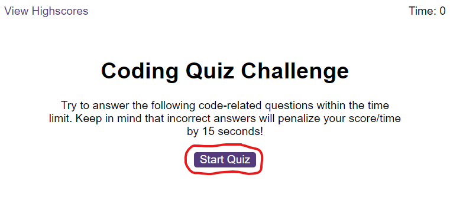
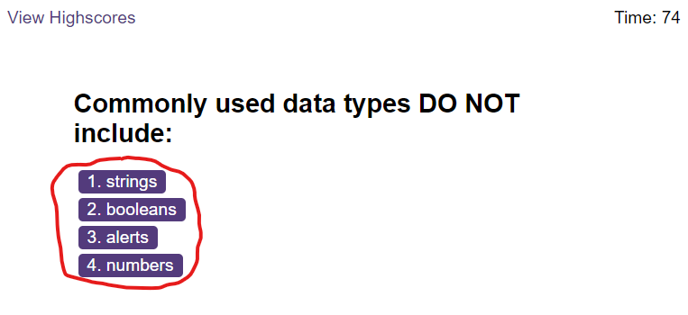
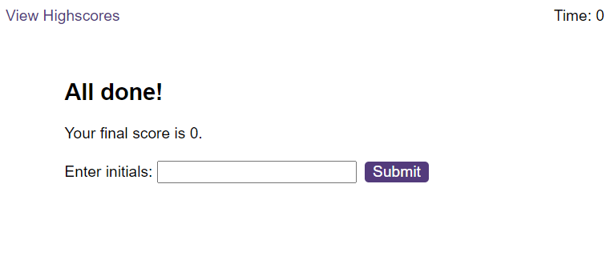
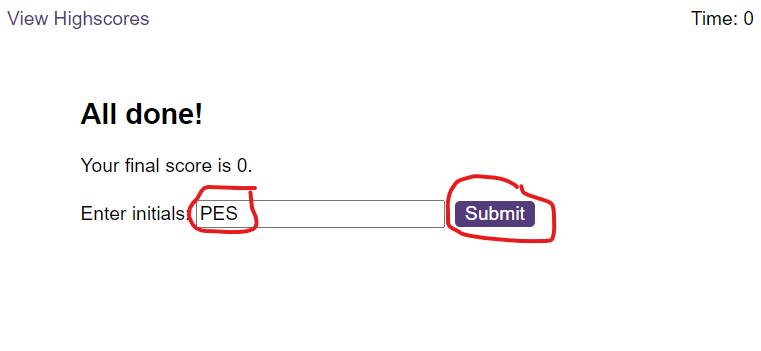
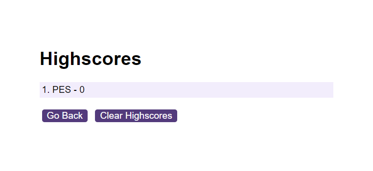

# Varnas Coding Quiz

A timed quiz on JavaScript fundamentals that allows users to gauge their progress compared to their peers.

## Table of Contents

1. [About the Project](#about-the-project)
2. [Getting Started](#getting-started)
3. [Prerequisites](#prerequisites)
4. [Installation](#installation)
5. [Usage](#usage)
6. [Contributing](#contributing)
7. [License](#license)

## About The Project

This web application provides a quiz for users to test their knowledge of JavaScript. Users are timed and are given a score based on how quickly they finish the quiz. Incorrect answers result in a time penalty, adding to the challenge.

## Getting Started

To get a local copy up and running, follow these simple steps.

## Prerequisites

* A modern web browser (Chrome, Firefox, Safari, Edge)

## Installation

- Clone the repository: https://github.com/KobayashiKerfuffle/varnas-quiz.git
- Open index.html in your web browser.

## Usage

Step #1: Start the quiz by clicking on the "Start Quiz" button.

Step #2: Select your answer to each question by clicking on the provided choices.

Step #3: After answering all questions or when the timer reaches zero, your game will end.

Step #4: Enter your initials and save your score to compare with others.

Step #5: View all high scores by navigating to the high scores page.

## Contributing

If you have suggestions or want to improve any aspects of this site, feel free to fork the repository and create a pull request.

## Credits

- All design and code by Peter Sadauskas.

## License

[MIT License](./LICENSE)